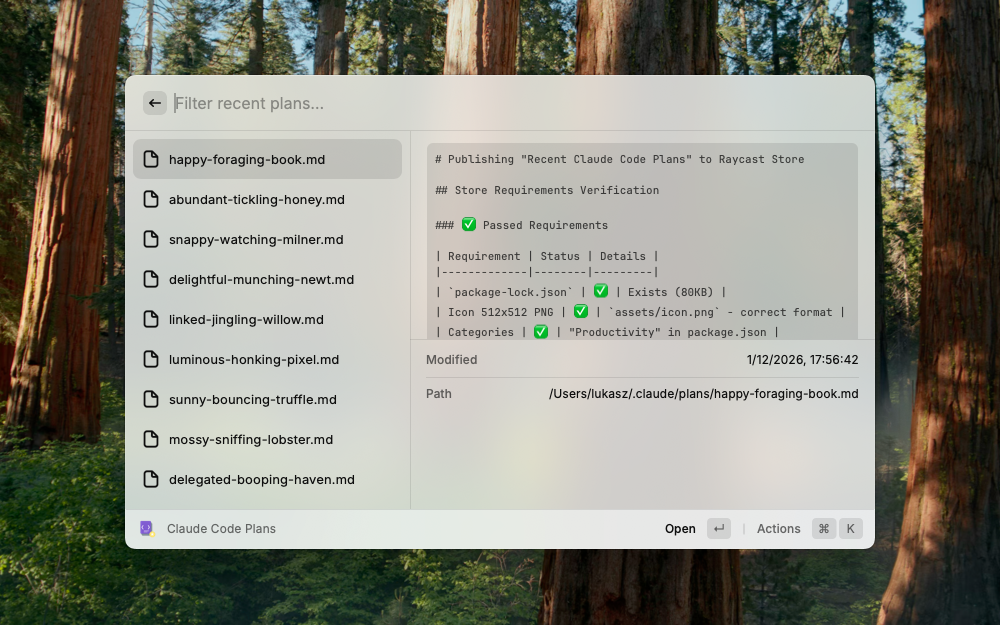

<p align="center">
  <strong>Recent Claude Code Plans</strong><br>
  A Raycast extension to quickly access your recent Claude Code plan files.
</p>

<p align="center">
  
</p>

---

## Features

- List recently modified plan files from ~/.claude/plans
- Preview file contents with syntax highlighting
- Open files in your preferred editor
- Configurable file limit and directory path

## Installation

1. Clone this repository
2. Run `npm install`
3. Run `npm run dev` to start development mode

## Configuration

| Preference   | Description                 | Default         |
|--------------|-----------------------------|-----------------|
| Directory    | Path to monitor             | ~/.claude/plans |
| Limit        | Number of files to show     | 10              |
| Editor       | Preferred app to open files | System default  |
| Show Preview | Enable file preview panel   | true            |

## Development

```bash
npm install       # Install dependencies
npm run dev       # Start development mode
npm run build     # Build extension
npm run lint      # Check for issues
npm run lint:fix  # Fix issues automatically
npm run typecheck # Run TypeScript checks
```

## License

MIT
